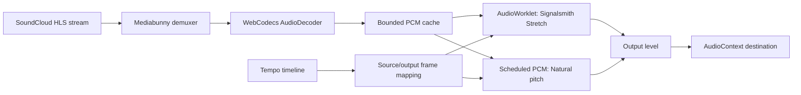

# SoundCloud Tempo Control



An unofficial SoundCloud playback controller with per-track speeds, optional pitch preservation and editable tempo timelines. This repository contains the userscript, its Astro website and a local track-preview backend.

## Status

This is a source preview, not a fully verified release. Extreme slowdown can produce unstable pitch, and the latest local browser run passed 18 of 19 suites, with an audio-boundary capture failure still open. The website and backend are not deployed. See the [current audit](docs/MAINTAINABILITY.md) for results and known limitations.

## Architecture

The diagram describes buffered playback below 0.25× on supported AAC-LC streams. Other speeds use the host media element with optional Signalsmith processing when its audio graph is available.

- **Bounded streaming:** encoded data and decoded PCM have explicit memory budgets. Seeking cancels obsolete work and discards old playback generations. This is a copied PCM cache, not a zero-copy lock-free ring buffer.
- **Clock mapping:** 128-frame windows map output frames to source frames using `rate × source sample rate / output sample rate`. This supports 0.025× without asking the browser media element to play below its supported range.
- **Audio scheduling:** Natural pitch schedules PCM buffers. Preserve key runs the pinned Signalsmith engine in an AudioWorklet. Buffer ownership, cancellation, EOF and host restoration are handled separately from timeline editing.
- **Automation:** timelines support instant, linear, quadratic ease and cubic smoothstep transitions. Saved profiles and copied links carry tempo and pitch mode.
- **Host integration:** buffered playback uses guarded access to SoundCloud's private player clock. A changed host build can invalidate that integration. An injected host-method failure recovered to native playback in the recorded candidate test; broader compatibility remains under review.

## Verification status

Source-position checks use a 50 µs tolerance against the audio-context clock, not wall time. Before the template cleanup, a twelve-minute Preserve run passed all clock checkpoints and continuously monitored 69 million frames without exact-zero samples, nonfinite samples or frame gaps. The earlier 620-second clock failure remains unexplained, and extreme-rate pitch checks have unresolved failures. The rebuilt local download has not repeated that live run or been verified in the installed userscript manager. Nothing has been published.

Muted live tests, generated-signal tests and sampled-output checks cover different risks. None substitutes for continuous captured audio or listening. Exact artifact hashes, failed runs and remaining gates are recorded in [playback evidence](docs/LOW_RATE_PLAYBACK.md) and [release review](docs/CODE_REVIEW.md).

## Run locally

Use Node 24, npm and Python 3.12 or newer. Open `soundcloud-tempo-control.code-workspace` in your editor, then:

```sh
npm ci --ignore-scripts
npm run setup:backend
npm run build
npm start
```

Open http://127.0.0.1:4322/. SoundCloud links load through yt-dlp without API credentials. Backend setup installs a pinned version in a local Python environment. The synth sample and local audio preview also work without that setup. See [backend setup](docs/BACKEND.md).

Press Play to load the default Drown (Sewerslvt Remix) demo. It does not fetch or play on page load. If loading fails, the demo offers a synth sample instead. Use the track disclosure to choose another SoundCloud link or local file.

`npm run dev` starts the Astro development site. `npm start` serves the built site and API together. Rebuild after changing source. No command publishes the project.

## Project layout

```text
src/                  Userscript behavior, templates and styles
server/               SoundCloud resolver and website server
site/                 Astro website and live audio preview
scripts/              Build and release tooling
tests/                Build, API and muted browser regressions
vendor/signalsmith/    Pinned upstream engine and license
docs/                 Setup, verification and code review
dist/                 Generated output, excluded from Git
```

`tempo-inline-source.js` wires the userscript into SoundCloud. The controls and editor each have separate template and style modules; playback and decoding live in `src/audio/`. The generated installer is a single file because userscript managers install one script. Edit the source modules, not the bundle.

## Playback

Natural mode lets pitch follow speed. Preserve key uses Signalsmith WASM when the player audio connection is available. Turn off **Use WASM for Preserve key** in Advanced audio to use browser preservation instead.

The userscript's speed range is 0.025 to 4×. The slider stops at 2× and adjusts by 0.025×. Speeds below 0.25× use buffered playback on supported AAC-LC streams; Preserve key at those speeds requires WASM. The website preview currently starts at 0.25×. Advanced audio also contains a global output level from -24 to 0 dB, initially -6 dB. It applies to all SoundCloud audio in both pitch modes and is separate from SoundCloud's volume control.

The source build bundles the pinned Signalsmith engine, WASM payload, buffered worklet and Mediabunny decoder. Playback does not download these dependencies. See [engine provenance](vendor/signalsmith/README.md) and [decoder provenance](vendor/mediabunny/NOTICE.md).

Settings contains a searchable library of saved speeds and timelines, with enable/disable, editing and removal undo. Export a backup to move settings between browsers. Import shows which saved entries and preferences will be replaced before confirmation.

## Verify and publish

```sh
npm run setup:decoder-probe
npm test
npm run typecheck
python -m pip install -r tests/requirements.txt
python -m playwright install chromium
npm run test:browser
```

[Testing](docs/TESTING.md) covers website checks and remaining live-player verification. [Code review](docs/CODE_REVIEW.md) records findings by subsystem.

Set the website URL, optional repository URL and PayPal link in `release.config.json` before publishing. An empty PayPal link hides the payment action. See [release instructions](docs/RELEASING.md).

MIT licensed. See [third-party licenses](THIRD_PARTY_LICENSES.md) for Signalsmith, Mediabunny and website assets. Not affiliated with SoundCloud. Screenshots and third-party assets retain their original rights.
