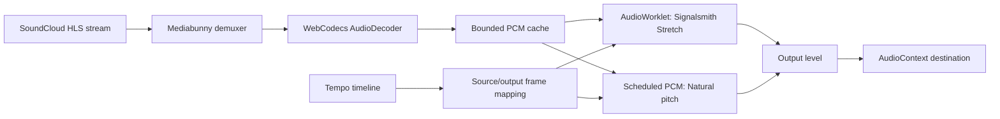

# Playback architecture

The diagram describes buffered playback below 0.25× on supported AAC-LC streams. Other speeds use the host media element with optional Signalsmith processing when its audio graph is available.

- **Bounded streaming:** encoded data and decoded PCM have explicit memory budgets. Seeking cancels obsolete work and discards old playback generations. This is a copied PCM cache, not a zero-copy lock-free ring buffer.
- **Clock mapping:** 128-frame windows map output frames to source frames using `rate × source sample rate / output sample rate`. This supports 0.025× without asking the browser media element to play below its supported range.
- **Audio scheduling:** Natural pitch schedules PCM buffers. Preserve key runs the pinned Signalsmith engine in an AudioWorklet. Buffer ownership, cancellation, EOF and host restoration are handled separately from timeline editing.
- **Automation:** timelines support instant, linear, quadratic ease and cubic smoothstep transitions. Saved profiles and copied links carry tempo and pitch mode.
- **Host integration:** buffered playback uses guarded access to SoundCloud's private player clock. A changed host build can invalidate that integration. An injected host-method failure recovered to native playback in the recorded candidate test; broader compatibility remains under review.
